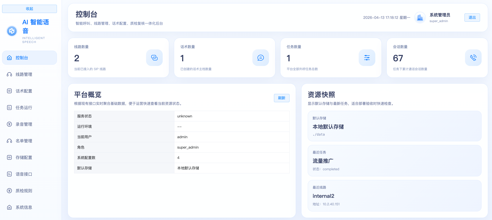
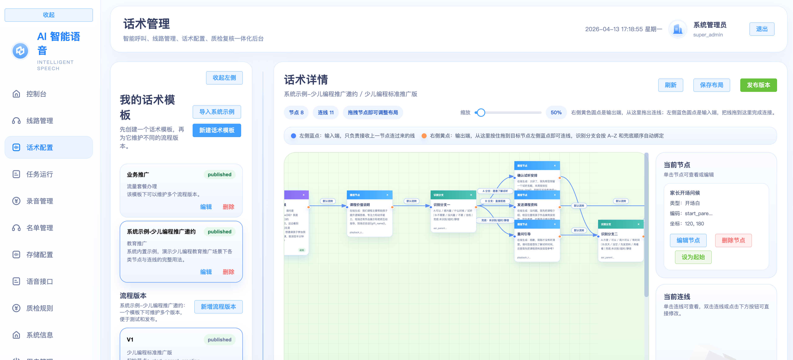

# AI VoIP

- 一个基于 `FastAPI + PostgreSQL + Vue3` 的智能外呼平台示例工程，覆盖 `SIP` 线路管理、话术编排、名单导入、任务外呼、录音管理、转写结果查看和基础质检能力。  
- 这个基础的版本将话术编排好后，拿到SIP账号后就可以做群拨了，由于实在是精力有限，其他的功能自己完善吧。  
- 同时本人也开发了一套在freeswitch中的推流模块，可以实现PCM注入，文件转写，也支持打断，支持高并发。详细的看这里[FreeSwitch推流模块](https://www.liaoxinghui.com/?p=636)  。
- 目前这一套中小型企业自用是完全足够了，录音也落盘了，同时支持minio存储，自己配置就行了。


## 待完善的功能
- 目前线路只有SIP，暂时还没做对接线路，也没有做ESL。
- 质检的功能各家情况不一样，这里只做了一个基础的版本，可以根据自己的需求进行扩展。

## 功能概览

- `SIP` 线路管理：支持 `sip_account` 与 `gateway`
- 话术画布：节点编排、分支配置、版本发布
- 名单与批次：联系人导入、批次归档
- 任务运行：任务调度、执行批次、会话列表
- 线路池并发：一个任务可绑定多条 `SIP` 线路，运行时按线路可用并发自动分配
- 录音管理：按通话展示录音文件，支持试听和下载
- 转写结果：按通话展示客服 / 客户对话时间线
- 质检与运行态：基础质检、日志排查、接口联调

## 页面预览

> 请将项目截图放在仓库根目录，并命名为 `index.png` 与 `script.png`。

### 首页



### 话术编排



## 项目结构

```text
.
├── README.md
├── SECURITY.md
├── ai_voip_backend
│   ├── README.md
│   ├── .env.example
│   ├── docs/API.md
│   ├── pyproject.toml
│   ├── sql/pgsql
│   └── src/ai_voip_backend
├── web-admin-vue3
    ├── .env.example
    ├── package.json
    └── src

```

## 环境要求

- Linux
- `uv`
- Python `3.10`
- PostgreSQL `14+`
- Node.js `20+`
- npm `10+`
- `ffmpeg 6.x`，如果需要处理录音或音频转码，建议提前安装

## 快速开始

### 1. 初始化后端

```bash
cd ai_voip_backend
cp .env.example .env
uv sync
uv run ai-voip-backend apply-sql
uv run ai-voip-backend bootstrap-admin --username admin --password '<YOUR_ADMIN_PASSWORD>' --display-name '系统管理员'
```

### 2. 启动后端

```bash
cd ai_voip_backend
uv run ai-voip-api
```

默认地址：

- API：`http://127.0.0.1:3900`
- Swagger：`http://127.0.0.1:3900/docs`
- OpenAPI：`http://127.0.0.1:3900/openapi.json`

### 3. 初始化前端

```bash
cd web-admin-vue3
cp .env.example .env
npm install
npm run dev
```

默认前端地址：

- Web Admin：`http://127.0.0.1:5173`

## 配置说明

### 后端环境变量

请参考 [ai_voip_backend/.env.example](ai_voip_backend/.env.example)：

- `AIVOIP_PG_HOST`：PostgreSQL 地址
- `AIVOIP_PG_PORT`：PostgreSQL 端口
- `AIVOIP_PG_USER`：数据库用户
- `AIVOIP_PG_PASSWORD`：数据库密码
- `AIVOIP_PG_DATABASE`：数据库名
- `AIVOIP_JWT_SECRET`：JWT 签名密钥
- `AIVOIP_TOKEN_ENCRYPTION_KEY`：访问令牌加密密钥

### 前端环境变量

请参考 [web-admin-vue3/.env.example](web-admin-vue3/.env.example)：

- `VITE_API_BASE_URL`：后端 API 基础地址

## 开发命令

### 后端

```bash
cd ai_voip_backend
uv sync
uv run ai-voip-backend list-sql
uv run ai-voip-backend apply-sql
uv run python -m compileall src
```

### 前端

```bash
cd web-admin-vue3
npm install
npm run dev
npm run build
```

## 日志与排查

后端启动时会自动初始化日志目录，默认写入 `ai_voip_backend/log`：

- `info.log`：接口访问、任务调度、关键业务操作等普通日志
- `error.log`：未处理异常、接口调用失败、健康检查失败等错误日志

常用排查命令：

```bash
cd ai_voip_backend
uv run ai-voip-backend show-log --type error --lines 100
uv run ai-voip-backend show-log --type info --lines 100
```

日志文件采用滚动写入，每个文件默认 10MB，最多保留 10 个历史文件。

### 本地流式 ASR 排查

如果在“语音接口”页面检测本地流式 ASR 时出现连接失败，或任务启动后没有自动外呼，请先确认：

- 本地流式 ASR 服务已经启动，并提供 `/start`、`/chunk`、`/finish` 三个接口。
- `endpoint` 是后端服务器能访问的地址；如果 ASR 服务不在后端同机，不能填写 `127.0.0.1`，需要填写后端可访问的实际 IP。
- 在后端机器上执行 `curl http://<ASR_HOST>:<PORT>/api/asr/stream/start` 或对应健康检查命令确认端口可达。
- 查看 `error.log` 中的 `本地流式 ASR 健康检查连接失败`、`实时 ASR 会话启动失败` 关键字，确认失败的 endpoint 和异常类型。

## 数据与存储

- 数据库统一使用 `PostgreSQL`
- 录音、TTS 产物、导出文件默认走本地目录
- 也支持 `MinIO / S3 Compatible`，但开源仓库不包含任何真实桶配置或访问密钥

## 文档

- 后端说明：[ai_voip_backend/README.md](ai_voip_backend/README.md)
- 接口文档：[ai_voip_backend/docs/API.md](ai_voip_backend/docs/API.md)

## License

本项目采用 `GPL-3.0` 开源协议，详见 [LICENSE](LICENSE)。
